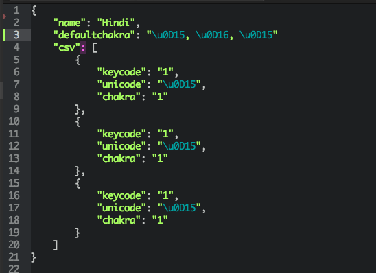

Swarachakra Parser for Web
==========================

Since, the languages are well split up from the view as discussed earlier, it is required to write a parser that makes the language in the desired format before building any application for the web platform. In the Chrome extension, the parser is written in ruby which converts the language Comma Separated Values (CSVs) into JavaScript Object Notation (JSON) format which can be very easily read by web applications.

The parser needs three inputs:
1. Language CSV file
2. Chakra text file
3. Path to output JSON file

The **first** input, the language CSV contains the key unicodes (unicode or string format), location of the unicode on the keyboard (integer), chakra properties (boolean) and layout properties (boolean).

The **second** input, the chakra text file contains a string of all entities what would be present inside the default chakra. If the key uses a customised chakra, the chakra properties in the JSON generated will override the values obtained from the txt file.

The **third** input, the path to the JSON file stores the JSON file created in the format as shown in the following image.

As we can see, the generated JSON contains the following keys:

1. code: integer - maps the key to layout
2. unicode: - string / unicode - unicode of the key
3. showchakra: - boolean - display / hide chakra
4. customchakralayout: - string - chakra keys
5. showicon: - boolean - display / hide icon
6. icon: - string - icon name
7. changelayout: - boolean - custom layout change
8. layout: - string - custom layout change value

The parser has used **Kannada** as the suitable CSV and it is extremely important that similar pattern of the CSV is followed for future development.

**Note**
The code of the parser is already released on the IDC Github Organisation page under a repository called Swarachakra-JSON-parser.
Due to  character escaping encountered while processing the CSV file, it might required to remove additional backlashes introduced in the JSON file. This is an issue with both ruby and python as tested by the author.
